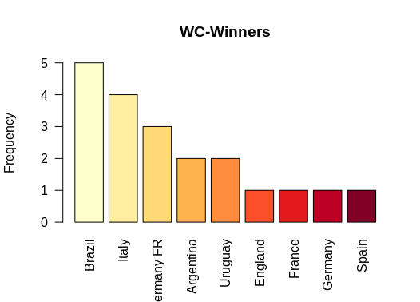
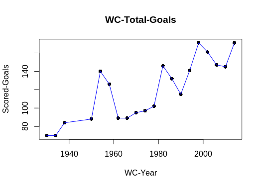
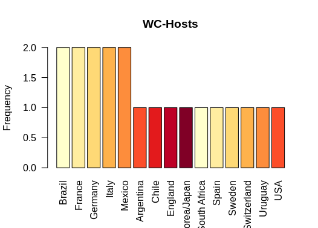
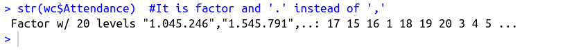
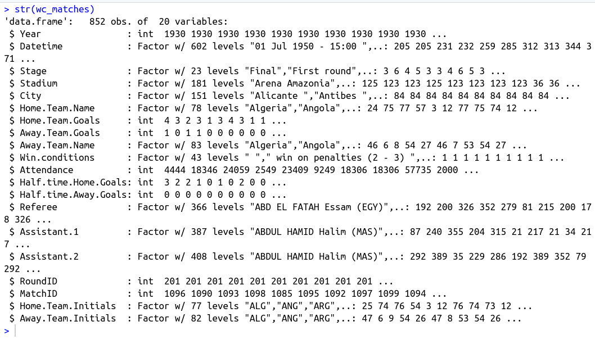
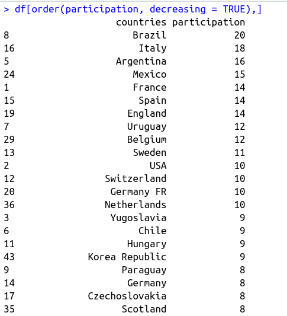
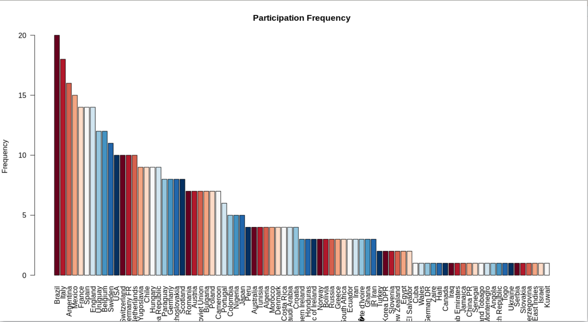
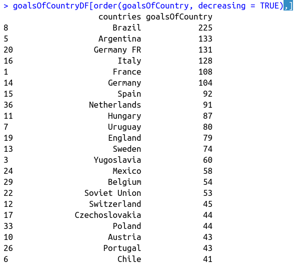
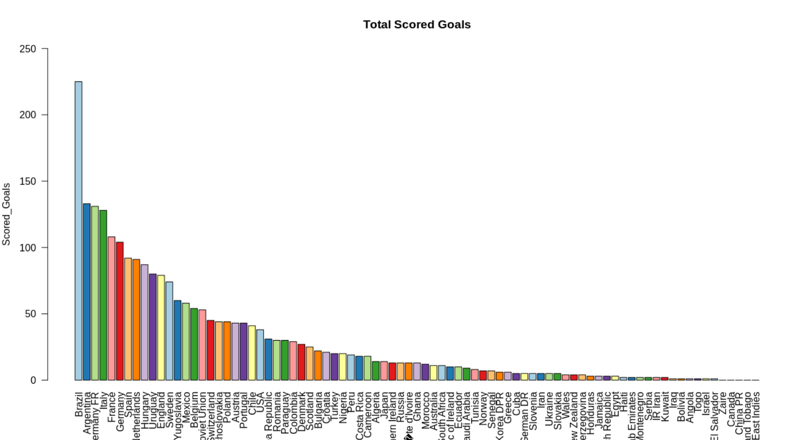
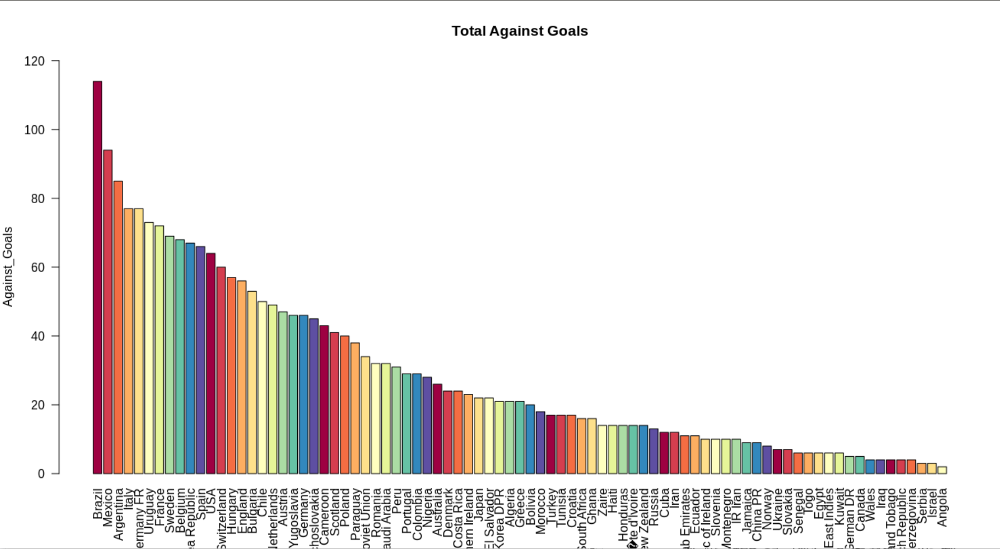

# FIFA-WC-Data-Analysis-In-R

This is a step-by-step demonstration of how I made analysis and visualization of FIFA-WC dataset available on kaggle.
NOTE: I am an absolute begginer. I just wanted to record my thoughts while doing analysis visually. You may find inspiring helpful parts, and you may also find some basic boring stuff.

## Dataset from kaggle :
[FIFA World Cup | Kaggle](https://www.kaggle.com/abecklas/fifa-world-cup)

## Lets Start!
There are 3 .csv files:
- WorldCups.csv
-   WorldCupMatches.csv
-   WorldCupPlayers.csv

### 1) Load The Data:
First thing to do is loading the data from .csv files to the environment memory as variable tables.

``` {r}==
# read data in .csv files (WorldCupMatches.csv, WorldCupPlayers.csv, WorldCups.csv)
wc_matches <- read.csv("WorldCupMatches.csv", header = TRUE)
wc_players <- read.csv("WorldCupPlayers.csv", header = TRUE)
wc <- read.csv("WorldCups.csv", header = TRUE)
```


### 2) WorldCup Table Exploration:
It is a good idea to explore each table separately at first before trying to find hidden relations within multiple tables.
So, lets explore the structure of **wc** table:

```
#start exploring "wc" table
#Display table structure
str(wc)
```

str() gives summary about the structure of an object. Calling str(wc) gives important information about the type of data inside **wc** table and how many **rows(obs.)** and **columns(variables)** are available.

### Start asking basic questions and answer them visually:
It is a good idea to start examining each **variable(column)** alone and take initial intution how its data beahves.

### 2.1) How many times did each country win a world cup?
```
table(wc$Winner)
barplot(sort(table(wc$Winner), decreasing = TRUE), las=2)
```
You can print the answer on the console:


Or, answer visually:


### 2.2) What is the total goals scored during each World-Cup?
```
#What's the total goals scored during every WC ?
#Connencted scattered plot
y <- wc$GoalsScored
x <- wc$Year
plot(x, y, xlim = range(x), ylim = range(y), pch=16, xlab = "WC-Year", ylab = "Scored-Goals")
lines(x, y, xlim = range(x), ylim = range(y), pch=16, col="blue")
```



### 2.3) Where did each World-Cup was hosted ?
```
#Where did each WC was hosted?
barplot(sort(table(wc$Country), decreasing = TRUE), las=2)
```


### 2.4) How many people attended each World-Cup ?
Here is a case where you need to modify the data to do complete your job.
By examining **wc$Attendance** column we find that it's factor and there is '.' instead of ',' inside each string.
```
str(wc$Attendance)  #It is factor and '.' instead of ','
```


We need to fix that :
```
#Attendance during each WC?
# Fixing format of wc$attendance
str(wc$Attendance)  #It is factor and '.' instead of ','
x <- wc$Year  # store data to be plotted on x-axis
ytemp <- gsub("\\.", "", wc$Attendance)  # replace '.' by ','
y <- as.numeric(ytemp)  # cast data in ytemp from factor to numeric and store it in variable y
str(ytemp)
str(y)
```
Now we can plot the graph (Year VS Attendants):

```
#Attendance during each WC? (ggplot)
library(ggplot2)
ggplot(wc, aes(x,y)) + 
  geom_point() +
  geom_line() +
  theme_bw() +
  theme_linedraw() +
  xlab("Year") +
  ylab("Attendants") +
  theme_classic(base_size = 15) +
  scale_x_continuous(breaks = round(seq(min(x), max(x), by = 8),1)) +
  scale_y_continuous(breaks = round(seq(min(y), max(y), by = 500000))) 
```


### 3) WorldCup_Matches Table Exploration:
This table contains observations about each match played in World Cups.



Using data of matches played we can make statistics for each country:

### 3.1) How many times each country participated in World-Cups ?
To answer this question we need to create frequency-table using data.frame structure:


And visually:


### 3.2) How many goals each country score in World-Cups ?
Again we will need frequency-table:


And visually:


### 3.3) How many goals scored against each country in World-Cups ?

Same idea ... frequency table:


And visually:



